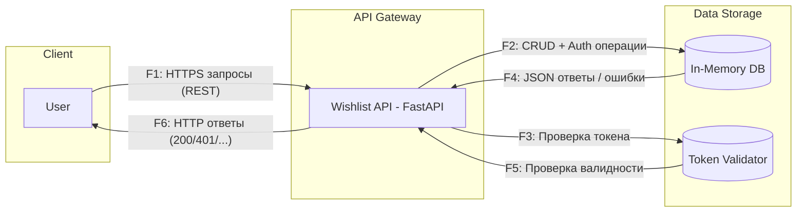
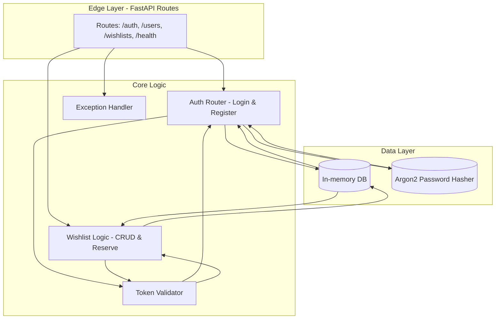
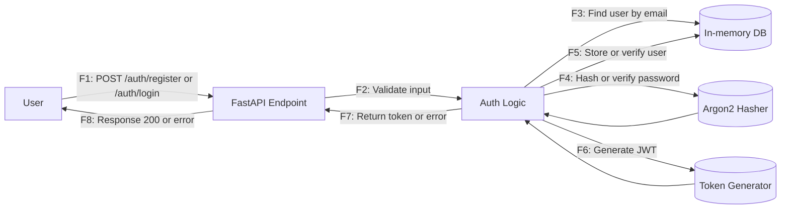
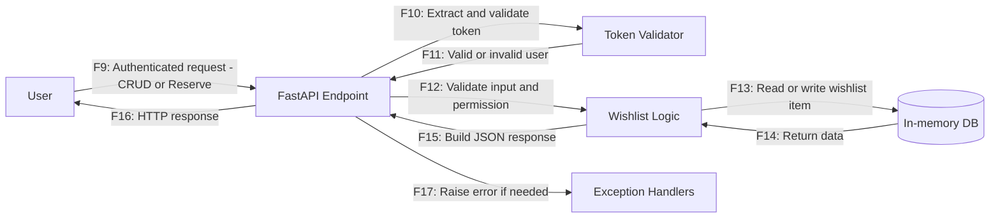

# DFD — Wishlist API

## Level 0 — Контекст

```mermaid
flowchart LR
    subgraph Client["Client"]
        U[User]
    end

    subgraph Gateway["API Gateway"]
        API["Wishlist API - FastAPI"]
    end

    subgraph Storage["Data Storage"]
        DB[(In-Memory DB)]
        JWT[(Token Validator)]
    end

    U -- "F1: HTTPS запросы (REST)" --> API
    API -- "F2: CRUD + Auth операции" --> DB
    API -- "F3: Проверка токена" --> JWT
    DB -- "F4: JSON ответы / ошибки" --> API
    JWT -- "F5: Проверка валидности" --> API
    API -- "F6: HTTP ответы (200/401/...)" --> U
```

## Level 1 — Логика

```mermaid
flowchart TB
    subgraph Edge["Edge Layer - FastAPI Routes"]
        FE["Routes: /auth, /users, /wishlists, /health"]
    end

    subgraph Core["Core Logic"]
        AUTH["Auth Router - Login & Register"]
        WISH["Wishlist Logic - CRUD & Reserve"]
        TOKEN["Token Validator"]
        ERR["Exception Handler"]
    end

    subgraph Data["Data Layer"]
        DB[(In-memory DB)]
        HASH[(Argon2 Password Hasher)]
    end

    FE --> AUTH
    FE --> WISH
    FE --> ERR

    AUTH --> HASH
    AUTH --> DB
    AUTH --> TOKEN
    WISH --> DB
    WISH --> TOKEN

    HASH --> AUTH
    DB --> AUTH
    DB --> WISH
    TOKEN --> AUTH
    TOKEN --> WISH
```

## Level 2 — Процессы - Registration/Login

```mermaid
flowchart LR
    U[User] -->|F1: POST /auth/register or /auth/login| FE[FastAPI Endpoint]
    FE -->|F2: Validate input| AUTH[Auth Logic]
    AUTH -->|F3: Find user by email| DB[(In-memory DB)]
    AUTH -->|F4: Hash or verify password| HASH[(Argon2 Hasher)]
    HASH --> AUTH
    AUTH -->|F5: Store or verify user| DB
    AUTH -->|F6: Generate JWT| TOKEN[(Token Generator)]
    TOKEN --> AUTH
    AUTH -->|F7: Return token or error| FE
    FE -->|F8: Response 200 or error| U

```

# Level 2 — Процессы - Wishlist CRUD + Reservation (/wishlists)

```mermaid
flowchart LR
    U[User] -->|F9: Authenticated request - CRUD or Reserve| FE[FastAPI Endpoint]
    FE -->|F10: Extract and validate token| TOKEN[Token Validator]
    TOKEN -->|F11: Valid or invalid user| FE

    FE -->|F12: Validate input and permission| WISH[Wishlist Logic]
    WISH -->|F13: Read or write wishlist item| DB[(In-memory DB)]
    DB -->|F14: Return data| WISH
    WISH -->|F15: Build JSON response| FE
    FE -->|F16: HTTP response| U
    FE -->|F17: Raise error if needed| ERR[Exception Handlers]
```
